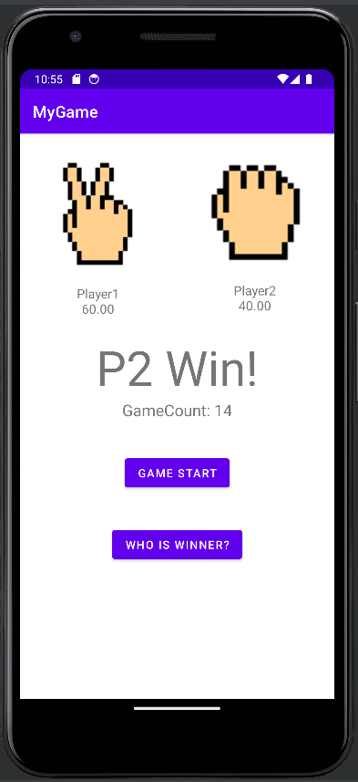

# AndroidStudio Study
## 1. Rock paper scissors App (MyGame folder)
</img>
</img>
</img>
</img> 
This game in which two players play rock-paper-scissors. 
### How to play?
1. press the Game start button, you will randomly play one of three things: scissors, rock, and paper. 
2. Press the "Who is winning?" button to determine the winner and loser. 
3. If the GameCount is greater than or equal to 10, the winning rate is displayed.
### Secret function
If GameCount is over 15.. 
Player1 is manipulated to a figure whose winning rate is set in the code. 
If you set the winning rate to 60%, Player 1 win from 15 over rounds until reaches 60%.

## 2. OneMinus App
</img>
</img>
</img>
</img> 
This game where you play two rock-paper-scissors and you take one out. 
1. click on the rock-paper-scissors image at the bottom, two players will play two of rock, paper, scissors.
2. Press the "하나 뺴기" button to remove one of the random ones.
3. The winning rate of each player is displayed.

## 3. Lotto App
</img>
</img>
</img> 
</img>
</img>
</img>

This app is a scratch lotte app.
Created using custom ImageVeiw.
1. When you run the app, type UserName and start.
2. Click the SUFFLE button to mix the lotteries.
3. Scratching the gray box turns yellow and results appear.
4. The results appear, and pressing the RESULT button increases score.

## 4. Food App
</img>
</img>
</img>
</img> 
This app is a food ordering app.
1. When you click '주문하기', the menu appears.
2. Pressing on the menu image increases the quantity.
3. Click on '주문' button to see the menu you selected and the total price.
4. If you click '결제' button, it will be saved as Excel.

## 5. CardGame App
</img>
</img>
</img>
</img> 
This game, you draw two cards and win if the sum of the cards is high.
1. When you click the Game start button, the two players randomly draw two cards.
2. The person with the highest sum of the two cards wins.

## 6. Other
1. Implement WebCrawling (WebCrawling Application)
2. Get stock information (stocklnfoApplication)
3. Interworking with other applications (Activirytest)
